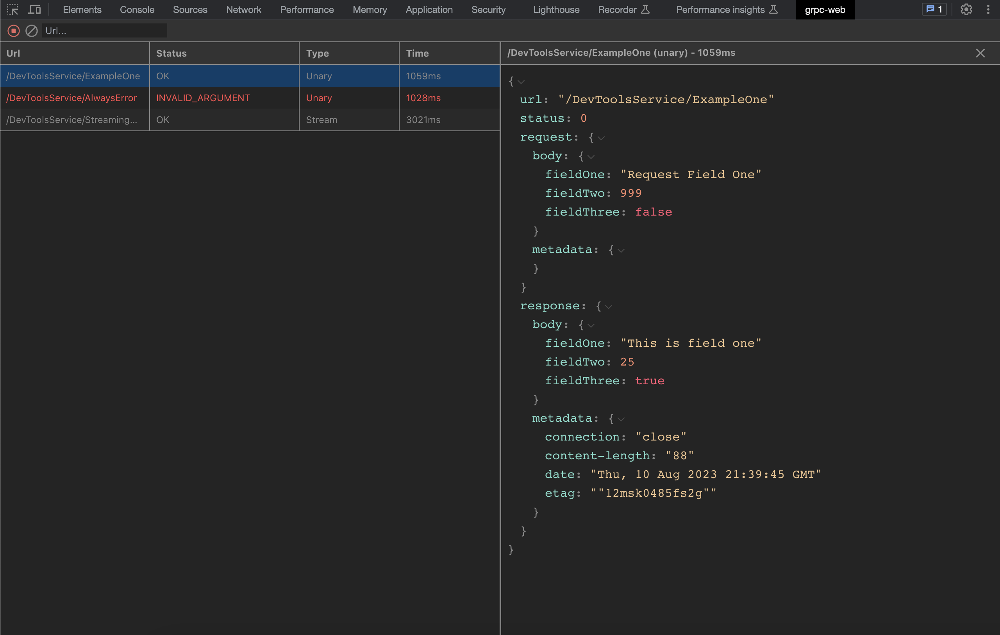

# grpc-web-devtools

[](http://makeapullrequest.com)



Within this extension, users gain the ability to effectively manage requests, employing advanced features such as request filtering and the purging of outdated requests. Notably, the extension is equipped with an intuitive JSON editor that enables in-depth inspection of both request and response elements, encompassing both body and metadata components for each interaction. This editor further offers the convenience of collapsing expansive objects for enhanced clarity, and supports easy content copying.

The scope of this extension's functionality extends to both UnaryRequest and StreamRequest interception. In the DevTools environment, when examining an unary call, the request showcases a structured representation featuring a body property denoting the transmitted object, as well as metadata encompassing supplementary headers sent during the request. This parallel structure is mirrored in the response, wherein the body signifies the object response from the server, and metadata encapsulates any extra headers furnished by the server.

For StreamRequest interactions, the structure is aligned with Unary, albeit with a distinction in the response. In the StreamRequest scenario, responses manifest as an array, encompassing key elements such as `data`, `status`, `error`, `metadata`, and `end`.

> [!NOTE]  
> The extension supports custom interceptors and streaming events are nor interfered by the extension so all events work by default.

## Installation

This extension currently is only available for Chrome. Firefox will be supported soon.

### Chrome

Install the [Chrome Extension](https://chrome.google.com/webstore/detail/grpc-web-devtools/aaindhgbimbgnnmdghdkigcagjbnldck) (recommended)

### Manual (Chrome)

1. Clone the repo
2. Install dependencies: `yarn install`
3. Build the extension: `yarn build:chrome:pro`
4. Open the **Extension Management** page by navigating to `chrome://extensions`.
4. Enable **Developer Mode** by clicking the toggle switch next to "Developer mode".
5. Click the **Load unpacked** button and select the extension `./chrome/build` directory.


## Usage

The extension injects a global `__GRPC_WEB_DEVTOOLS__` function into the page. This function injects the interceptors into the gRPC-Web client to connect with the devtools.


### JavaScript

```javascript
const defaultTools = options => options;

const grpcDevTools =
	typeof __GRPC_WEB_DEVTOOLS__ !== 'undefined' ? __GRPC_WEB_DEVTOOLS__ : defaultTools;

const devToolsService = new DevToolsServicePromiseClient('YOUR_DOMAIN', null, grpcDevTools());

``` 

### TypeScript

```typescript
type ServiceOptions = {
	unaryInterceptors: UnaryInterceptor<pb.Message, pb.Message>[];
	streamInterceptors: StreamInterceptor<pb.Message, pb.Message>[];
};


const defaultTools = (options?: ServiceOptions) => options;

declare const __GRPC_WEB_DEVTOOLS__: (options?: null | ServiceOptions) => ServiceOptions;

const grpcDevTools =
	typeof __GRPC_WEB_DEVTOOLS__ !== 'undefined' ? __GRPC_WEB_DEVTOOLS__ : defaultTools;

const devToolsService = new DevToolsServicePromiseClient('YOUR_DOMAIN', null, grpcDevTools());
```

### Using custom interceptors

In case you are using custom interceptors in your app you can pass them to the `__GRPC_WEB_DEVTOOLS__` function and any other configuration that a `grpc-web` service accepts.


```typescript
import MyUnaryInterceptor from './my-unary-interceptor';
import MyStreamInterceptor from './my-stream-interceptor';

type ServiceOptions = {
	unaryInterceptors: UnaryInterceptor<pb.Message, pb.Message>[];
	streamInterceptors: StreamInterceptor<pb.Message, pb.Message>[];
};


const defaultTools = (options?: ServiceOptions) => options;

declare const __GRPC_WEB_DEVTOOLS__: (options?: null | ServiceOptions) => ServiceOptions;

const grpcDevTools =
	typeof __GRPC_WEB_DEVTOOLS__ !== 'undefined' ? __GRPC_WEB_DEVTOOLS__ : defaultTools;

const devToolsService = new DevToolsServicePromiseClient('YOUR_DOMAIN', null, grpcDevTools({
    unaryInterceptors: [new MyUnaryInterceptor()],
    streamInterceptors: [new MyStreamInterceptor()],
}));
```

## Example

You can find a working example in the `example` directory. This is build with `NextJS` and uses a custom node implementation to simulate `grpc-web` server behavior. 

You can run the example:

1. Install dependencies: `cd ./example && yarn install`
2. Start the example: `yarn dev`
3. Open [http://localhost:3000](http://localhost:3000)